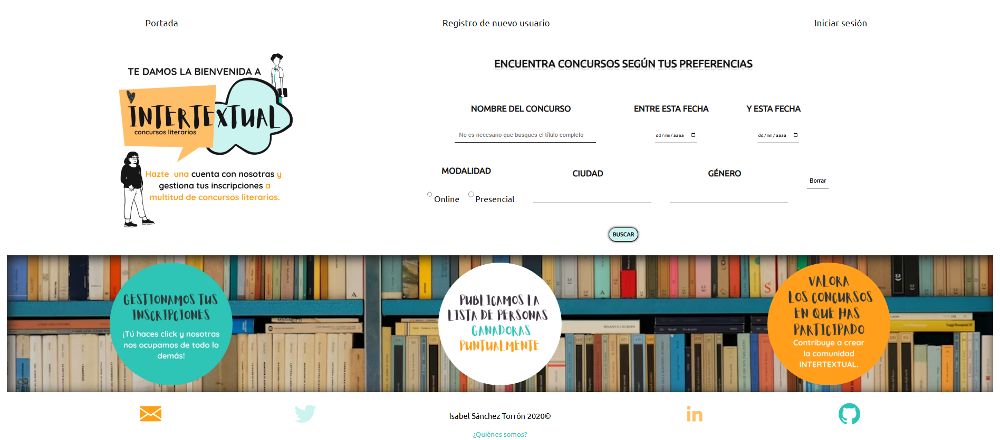
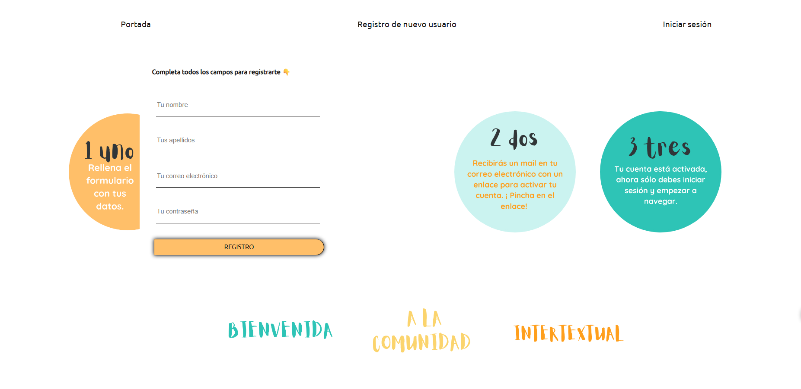
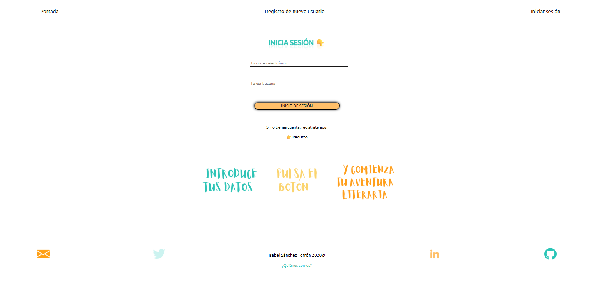

# 📚 Concursos Literarios — Agregador y gestor de convocatorias

Aplicación web fullstack para centralizar, gestionar e inscribirse en concursos literarios. Desarrollada como proyecto final del Bootcamp Full-Stack de Hack a Boss (2020).

---

## 🧩 ¿Qué hace?

La plataforma permite a escritoras y escritores encontrar convocatorias literarias activas, próximas o ya finalizadas, inscribirse en ellas, y valorarlas una vez participadas. Incluye un panel de administración para gestionar el contenido de la plataforma.

---

## ⚙️ Stack tecnológico

| Capa | Tecnología |
|------|------------|
| Frontend | Vue.js |
| Backend | Node.js + Express |
| Base de datos | MySQL |
| Validaciones | Hapi-Joi |
| Autenticación | JWT + bcrypt |
| Email | Nodemailer |
| Testing de API | Postman |

---

## ✨ Funcionalidades principales

### Gestión de usuarios
- Registro con validación por email
- Login con JWT
- Edición de perfil y cambio de contraseña
- Historial de inscripciones
- Desactivación y borrado de cuenta
- Sistema de roles (usuario / administrador)

### Gestión de concursos (rol admin)
- Crear, editar y borrar convocatorias
- Asignar ganador/a
- Subida de imagen de portada
- Vistas filtradas: próximos, en curso, finalizados

### Inscripciones
- Inscripción y cancelación de participación
- Consulta de participantes por concurso
- Valoración post-participación (una por inscripción, vinculada a la tabla de inscripciones para garantizar integridad)
- Ranking de concursos por valoración media

### Arquitectura backend
- Estructura modular: rutas, middlewares, validaciones y helpers separados
- Consultas SQL multitabla (JOINs) para datos cruzados
- Protección contra inyección SQL
- Validación de datos de entrada con esquemas Joi
- Formateo de fechas y verificación de unicidad de campos

---

## 🗂️ Estructura del proyecto

```
/
├── Backend/
│   ├── middlewares/
│   ├── validations/      # Esquemas Joi
│   ├── helpers/
│   └── routes/           # usuarios, concursos, inscripciones
├── Frontend/             # Vue.js
├── BD/                   # Scripts SQL
└── Documentacion/
```

---

## 🚀 Instalación local

```bash
# Clona el repositorio
git clone https://github.com/SiraPerriki/PROYECTO.git

# Instala dependencias del backend
cd Backend
npm install

# Configura las variables de entorno
cp .env.example .env
# Edita .env con tus credenciales de base de datos y JWT secret

# Importa la base de datos
# Usa el script SQL incluido en /BD

# Arranca el servidor
npm run dev

# En otra terminal, instala y arranca el frontend
cd ../Frontend
npm install
npm run serve
```

---

## 📸 Capturas de pantalla

| Landing | Registro | Login |
|---|---|---|
|  |  |  |

---

## 🎨 Diseño y planificación

El proyecto partió de un proceso de diseño UX completo antes de escribir ninguna línea de código: arquitectura de información, flujos de usuario y wireframes de todas las pantallas, con vistas diferenciadas por rol (usuario / administrador) y estados condicionales.

**Mapa completo de pantallas y flujos:**


**Wireframes:**

| Landing y registro | Perfil de usuario | Ficha de concurso |
|---|---|---|
|  |  |  |

| Detalle concurso | Panel admin |
|---|---|
|  |  |

---

## 💭 Decisiones técnicas destacadas

**Valoraciones integradas en inscripciones:** En lugar de mantener una tabla separada de valoraciones (que replicaría las claves foráneas de inscripciones), opté por añadir el campo `valoracion` directamente en la tabla de inscripciones. Esto garantiza la restricción de una valoración por participante y por concurso sin duplicar estructura. La solución es funcional aunque abre preguntas interesantes sobre normalización vs. pragmatismo.

**Validación con Hapi-Joi:** Toda entrada de datos pasa por esquemas de validación centralizados antes de llegar a la base de datos, separando esta responsabilidad del controlador de rutas.

---

## 🗺️ Roadmap

- [ ] Buscador general con filtrado por todos los campos simultáneamente (incluyendo rango de fechas)
- [ ] Rehabilitación de cuentas desactivadas
- [ ] Paginación en listados
- [ ] Notificaciones por email sobre concursos próximos a vencer

---

## 📝 Notas de desarrollo

Este proyecto incluye un archivo [`Reflexiones_sobre_el_desarrollo.txt`](./Reflexiones_sobre_el_desarrollo.txt) con notas del proceso: cómo se definió el modelo de datos, qué preguntas surgieron sobre el producto antes de empezar a desarrollar, y por qué se tomaron ciertas decisiones.

---

*Proyecto desarrollado en abril, mayo y junio de 2020 como trabajo final de un bootcamp.
